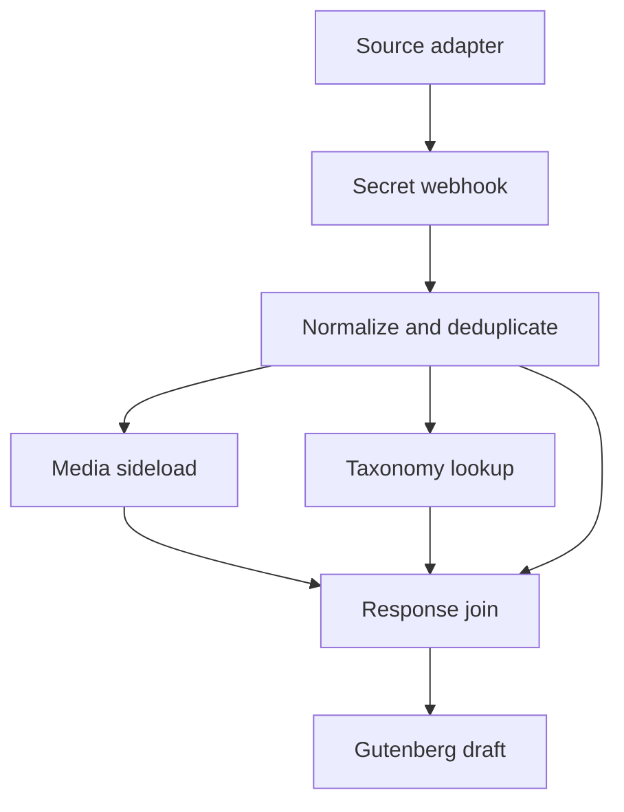

# PESOS social archive for Huginn and WordPress

This repository is a platform-neutral archive core for [PESOS](https://indieweb.org/PESOS): publish on a social platform, then send a canonical copy to a site you control.

Six working social-post pipelines—Bluesky, Instagram, Mastodon, Threads, Tumblr, and Twitter/X—were reduced to the part they actually share. Platform APIs and IFTTT ingredients remain adapters. Huginn receives one stable Event, validates it, localizes its media, reconstructs the post as Gutenberg blocks, creates source taxonomy, and asks WordPress to save a draft.

The source exports are intentionally not included. This template contains no production hostname, account identifier, webhook secret, WordPress username, application password, or personal credential name.

## Architecture



The direct normalizer-to-join link carries the job manifest. The other branches return WordPress IDs. The join emits only when every declared dependency has arrived; a failed media or taxonomy request therefore cannot produce a deceptively complete archive post.

## What the template preserves

- the source URL, source identity, author label, and original publication time;
- supplied titles or a short incipit fallback;
- paragraphs, headings, quotations, preformatted text, lists, links, and inline emphasis from conservative HTML;
- explicit media arrays, Tumblr-style inline images, and single-photo fields;
- local WordPress media IDs, image alt text, and the first image as featured media;
- one WordPress category per source and normalized hashtag terms;
- a source-attribution Gutenberg block;
- a 14-day in-memory duplicate window keyed by `source:source_id`.

The default status is `draft`. Comments and pings are closed.

## Event contract

An adapter POSTs one JSON object to Huginn:

```json
{
  "source": "bluesky",
  "source_name": "Bluesky",
  "source_id": "3examplepostid",
  "source_url": "https://bsky.app/profile/example.test/post/3examplepostid",
  "author": "example.test",
  "created_at": "2026-08-30T09:15:00Z",
  "title": "",
  "text": "A post worth keeping. #socialposts #indieweb",
  "tags": ["optional-explicit-tag"],
  "media": [
    {
      "url": "https://cdn.example/image.jpg",
      "kind": "image",
      "alt": "A useful description",
      "title": "Optional media title"
    }
  ],
  "media_position": "after",
  "language": "en",
  "trigger_tag": "socialposts"
}
```

Required fields are `source`, `source_url`, `created_at`, and `trigger_tag`. `source_id` is strongly recommended; without it, the normalizer derives an identifier from the URL. `source_url` and media URLs must be public HTTPS URLs.

Content may arrive as `text`, `body_text`, `caption`, or `content_text`. Conservative rich content may use `body_html` or `html`. Media may arrive as `media`/`attachments`, or through a singular `media_url`, `image_url`, `photo_url`, or `source_media_url`. See the [JSON Schema](docs/EVENT.schema.json) and the six fixtures in [`examples/events`](examples/events).

## Quick start

1. Copy `config.example.json` to `config.json`.
2. Create two Huginn credentials for the WordPress username and application password. Their names—not their values—go in `config.json`.
3. Set a long random webhook secret and your WordPress HTTPS origin.
4. Render and validate the private Scenario:

   ```sh
   make template
   python3 tools/render.py config.json
   make test
   ```

5. Import `build/pesos-social-to-wordpress.json` into Huginn.
6. Send one fixture-shaped Event to the Webhook Agent URL and inspect the resulting WordPress draft.

`config.json` and `build/` are ignored by Git. If you deliberately switch `post_status` to `publish`, rendering also requires `--allow-publish`.

## WordPress assumptions

The Scenario uses a dedicated WordPress application password and the REST endpoints for posts, categories, tags, and media.

The media branch assumes that `POST /wp-json/wp/v2/media` accepts the JSON sideload form used by the source Scenarios:

```json
{
  "url": "https://cdn.example/image.jpg",
  "alt_text": "Description",
  "title": "Title",
  "generate_sub_sizes": true
}
```

Verify that behavior on your WordPress installation. If it is unavailable, replace Agent 04 with a small authenticated upload bridge while preserving the response shape: HTTP `201` with `id`, `source_url`, and preferably `alt_text`.

WordPress may return an existing taxonomy term as an error body containing `data.term_id`; the join treats that as a successful resolution.

## Adapter boundary

An adapter should do only what the source demands: poll an API, receive an IFTTT trigger, expand a platform-specific object, and map it to the Event contract. The archive core should not know whether a post came from an AT URI, a Mastodon status object, a Tumblr HTML body, or an IFTTT ingredient.

That boundary is also a safety property. Twitter short-link resolution is omitted from the core because a generic webhook must not become an arbitrary URL fetcher. Supply expanded links from a trusted adapter. Mastodon polling likewise belongs upstream, where the instance origin and account ID can be fixed rather than accepted from incoming data.

Platform mapping notes are in [`docs/ADAPTERS.md`](docs/ADAPTERS.md).

## Deliberate limits

- Deduplication survives 14 days in Huginn memory, not forever. A production archive can add a WordPress lookup keyed by source ID or a registered metadata field.
- The HTML parser is conservative and intentionally smaller than a browser. WordPress KSES remains the final content boundary.
- The public-HTTPS check blocks obvious local and private literal hosts; it cannot detect every DNS rebinding or redirect path. Apply outbound controls and a media-host allowlist at the network or upload-bridge layer.
- A webhook path secret authenticates possession, not authorship. Protect Huginn with TLS, rate limits, and normal operational controls.
- This is a base to extend, not a claim that six social networks expose equivalent data.

## Repository maintenance

`src/normalize.js` and `src/collect.js` are the readable sources. `tools/build_template.py` embeds them in Huginn’s JSON export format. Run `make template` after changing either file; CI checks JSON structure, graph links, JavaScript syntax when Node is available, placeholders, fixtures, safe defaults, and common leakage patterns.

## License

MIT. Replace the generic copyright line if you publish a maintained fork under your own name.
